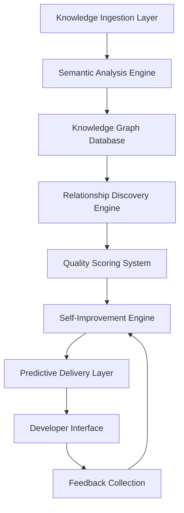

# 🧠 Meta-Knowledge System Design
*Generated: 2025-09-02 | Model: Claude Opus 4.1 | Mission: Create self-improving, self-organizing knowledge*

## Executive Vision
Design a knowledge system that doesn't just store information, but actively learns, evolves, and improves itself. A system that understands its own gaps, measures its own effectiveness, and continuously optimizes for developer success.

## 🌟 CORE ARCHITECTURE: The Living Knowledge Graph

### System Components



### Implementation Blueprint

```python
# knowledge_system/core.py
class MetaKnowledgeSystem:
    """
    A self-aware, self-improving knowledge management system
    """
    
    def __init__(self):
        self.graph = KnowledgeGraph()
        self.analyzer = SemanticAnalyzer()
        self.predictor = PredictiveEngine()
        self.improver = SelfImprovementEngine()
        self.metrics = MetricsCollector()
        
    def ingest(self, source):
        """Intelligently process and store new knowledge"""
        # Extract content
        content = self.extract_content(source)
        
        # Analyze semantically
        analysis = self.analyzer.analyze(content)
        
        # Find relationships
        relationships = self.discover_relationships(analysis)
        
        # Calculate quality score
        quality = self.assess_quality(content, analysis)
        
        # Store in graph
        node = self.graph.add_node(
            content=content,
            metadata=analysis,
            relationships=relationships,
            quality=quality,
            created_at=datetime.now()
        )
        
        # Trigger learning
        self.learn_from_addition(node)
        
        return node
    
    def retrieve(self, query, context):
        """Intelligently retrieve relevant knowledge"""
        # Predict what will be needed
        predicted_needs = self.predictor.predict(query, context)
        
        # Find relevant nodes
        relevant = self.graph.search(
            query=query,
            predicted_needs=predicted_needs,
            max_tokens=context.token_budget
        )
        
        # Track retrieval
        self.metrics.track_retrieval(query, relevant)
        
        # Learn from usage
        self.improver.learn_from_retrieval(query, relevant)
        
        return self.optimize_delivery(relevant, context)
    
    def self_improve(self):
        """Continuously improve the knowledge system"""
        while True:
            # Identify gaps
            gaps = self.identify_knowledge_gaps()
            
            # Find stale content
            stale = self.find_stale_knowledge()
            
            # Discover new relationships
            new_relationships = self.discover_hidden_relationships()
            
            # Generate missing documentation
            self.generate_missing_docs(gaps)
            
            # Update stale content
            self.refresh_stale_docs(stale)
            
            # Strengthen relationships
            self.strengthen_relationships(new_relationships)
            
            # Measure improvement
            self.metrics.measure_improvement()
            
            time.sleep(3600)  # Run hourly
```

## 🔄 SELF-IMPROVEMENT MECHANISMS

### 1. Automatic Knowledge Extraction

```ruby
# lib/knowledge_extraction/code_analyzer.rb
class KnowledgeExtraction::CodeAnalyzer
  def extract_knowledge_from_commit(commit)
    knowledge = {
      problem: extract_problem(commit),
      solution: extract_solution(commit),
      patterns: extract_patterns(commit),
      learnings: extract_learnings(commit)
    }
    
    # Extract problem from commit message and diff
    def extract_problem(commit)
      # Analyze commit message
      if commit.message =~ /fix|bug|issue|problem/i
        problem = {
          type: :bug_fix,
          description: commit.message,
          symptoms: extract_symptoms_from_diff(commit.diff)
        }
      elsif commit.message =~ /feat|add|implement/i
        problem = {
          type: :feature,
          description: commit.message,
          requirements: extract_requirements(commit.diff)
        }
      end
      
      problem
    end
    
    # Extract solution from code changes
    def extract_solution(commit)
      changes = parse_diff(commit.diff)
      
      solution = {
        approach: categorize_approach(changes),
        code_changes: changes,
        complexity: calculate_complexity(changes),
        impact: analyze_impact(changes)
      }
      
      # Learn from the solution
      if solution[:complexity] < 10 && solution[:impact] > 0.5
        mark_as_elegant_solution(solution)
      end
      
      solution
    end
    
    # Store in knowledge base
    KnowledgeNode.create!(
      type: :solution,
      problem: knowledge[:problem],
      solution: knowledge[:solution],
      patterns: knowledge[:patterns],
      quality_score: calculate_quality(knowledge),
      auto_generated: true
    )
  end
end
```

### 2. Feedback Loop Learning

```javascript
// knowledge_system/feedback_learner.js
class FeedbackLearner {
  constructor() {
    this.neuralNetwork = new NeuralNetwork();
    this.trainingData = [];
  }
  
  collectImplicitFeedback(interaction) {
    const feedback = {
      query: interaction.query,
      results_shown: interaction.results,
      
      // Implicit positive signals
      result_clicked: interaction.clicked,
      time_spent: interaction.dwellTime,
      code_copied: interaction.copiedCode,
      problem_solved: interaction.nextQueryDelay > 300000, // 5 min = solved
      
      // Implicit negative signals
      refined_search: interaction.refinedQuery !== null,
      abandoned: interaction.dwellTime < 5000,
      different_search: this.detectTopicChange(interaction),
      
      // Context
      developer_experience: interaction.user.commits_count,
      time_of_day: interaction.timestamp.getHours(),
      task_complexity: this.estimateComplexity(interaction.context)
    };
    
    this.trainingData.push(feedback);
    
    // Retrain periodically
    if (this.trainingData.length % 100 === 0) {
      this.retrain();
    }
  }
  
  retrain() {
    // Prepare training data
    const processed = this.trainingData.map(f => ({
      input: this.extractFeatures(f),
      output: this.calculateEffectiveness(f)
    }));
    
    // Train neural network
    this.neuralNetwork.train(processed);
    
    // Update knowledge graph weights
    this.updateKnowledgeWeights();
    
    // Generate insights
    const insights = this.generateInsights();
    
    // Apply improvements
    this.applyImprovements(insights);
  }
  
  generateInsights() {
    return {
      most_effective_docs: this.findHighPerformers(),
      problematic_areas: this.findLowPerformers(),
      missing_connections: this.findMissingLinks(),
      usage_patterns: this.analyzePatterns(),
      improvement_opportunities: this.identifyOpportunities()
    };
  }
}
```

### 3. Quality Scoring Algorithm

```ruby
class QualityScorer
  def calculate_knowledge_quality(node)
    scores = {
      completeness: assess_completeness(node),
      accuracy: assess_accuracy(node),
      clarity: assess_clarity(node),
      relevance: assess_relevance(node),
      freshness: assess_freshness(node),
      usefulness: assess_usefulness(node)
    }
    
    # Weighted average based on learned importance
    weights = load_learned_weights()
    
    total_score = scores.sum { |metric, score| score * weights[metric] }
    
    # Decay over time
    age_days = (Time.current - node.created_at) / 1.day
    decay_factor = Math.exp(-age_days / 365.0)  # Half-life of 1 year
    
    final_score = total_score * decay_factor
    
    # Update node
    node.update!(
      quality_score: final_score,
      quality_breakdown: scores,
      last_scored_at: Time.current
    )
    
    # Trigger actions based on score
    if final_score < 0.3
      schedule_refresh(node)
    elsif final_score < 0.5
      flag_for_review(node)
    end
    
    final_score
  end
  
  private
  
  def assess_completeness(node)
    checklist = [
      has_description?,
      has_examples?,
      has_error_cases?,
      has_related_links?,
      has_prerequisites?,
      has_verification_steps?
    ]
    
    checklist.count(&:itself) / checklist.length.to_f
  end
  
  def assess_accuracy(node)
    # Check if code examples run
    code_blocks = extract_code_blocks(node.content)
    
    working = code_blocks.count do |code|
      test_code_block(code)
    end
    
    return 1.0 if code_blocks.empty?
    
    working / code_blocks.length.to_f
  end
  
  def assess_usefulness(node)
    # Based on actual usage
    views = node.view_count
    copies = node.copy_count
    success_rate = node.problem_resolution_rate
    
    # Normalize and combine
    (
      sigmoid(views / 100.0) * 0.3 +
      sigmoid(copies / 10.0) * 0.3 +
      success_rate * 0.4
    )
  end
end
```

### 4. Relationship Discovery Engine

```python
# knowledge_system/relationship_discovery.py
class RelationshipDiscoveryEngine:
    def __init__(self):
        self.graph = KnowledgeGraph()
        self.nlp = spacy.load("en_core_web_lg")
        self.embedder = SentenceTransformer('all-MiniLM-L6-v2')
        
    def discover_hidden_relationships(self):
        """Find non-obvious connections between knowledge nodes"""
        
        discoveries = []
        
        # Semantic similarity
        discoveries.extend(self.find_semantic_similarities())
        
        # Co-occurrence patterns
        discoveries.extend(self.find_cooccurrence_patterns())
        
        # Causal relationships
        discoveries.extend(self.find_causal_relationships())
        
        # Temporal patterns
        discoveries.extend(self.find_temporal_patterns())
        
        # Apply discoveries
        for discovery in discoveries:
            self.create_relationship(discovery)
            
        return discoveries
    
    def find_semantic_similarities(self):
        """Find nodes that are semantically similar but not linked"""
        
        nodes = self.graph.get_all_nodes()
        embeddings = {}
        
        # Generate embeddings for all nodes
        for node in nodes:
            embeddings[node.id] = self.embedder.encode(node.content)
        
        # Find similar pairs
        similarities = []
        
        for i, node1 in enumerate(nodes):
            for node2 in nodes[i+1:]:
                # Skip if already related
                if self.graph.are_related(node1, node2):
                    continue
                
                # Calculate similarity
                similarity = cosine_similarity(
                    embeddings[node1.id].reshape(1, -1),
                    embeddings[node2.id].reshape(1, -1)
                )[0][0]
                
                if similarity > 0.8:
                    similarities.append({
                        'type': 'semantic_similarity',
                        'source': node1,
                        'target': node2,
                        'strength': similarity,
                        'auto_discovered': True
                    })
        
        return similarities
    
    def find_cooccurrence_patterns(self):
        """Find nodes that are frequently accessed together"""
        
        access_logs = self.get_access_logs()
        cooccurrences = defaultdict(int)
        
        # Count co-occurrences within sessions
        for session in access_logs:
            nodes = session['accessed_nodes']
            
            for i, node1 in enumerate(nodes):
                for node2 in nodes[i+1:]:
                    if node1 != node2:
                        pair = tuple(sorted([node1, node2]))
                        cooccurrences[pair] += 1
        
        # Find significant patterns
        patterns = []
        threshold = np.percentile(list(cooccurrences.values()), 90)
        
        for (node1, node2), count in cooccurrences.items():
            if count > threshold:
                patterns.append({
                    'type': 'frequent_cooccurrence',
                    'source': node1,
                    'target': node2,
                    'strength': count / len(access_logs),
                    'auto_discovered': True
                })
        
        return patterns
    
    def find_causal_relationships(self):
        """Identify cause-effect relationships in documentation"""
        
        causal_patterns = [
            r"causes?",
            r"leads? to",
            r"results? in",
            r"triggers?",
            r"because of",
            r"due to",
            r"consequently",
            r"therefore"
        ]
        
        relationships = []
        
        for node in self.graph.get_all_nodes():
            doc = self.nlp(node.content)
            
            for sent in doc.sents:
                for pattern in causal_patterns:
                    if re.search(pattern, sent.text, re.IGNORECASE):
                        # Extract cause and effect
                        cause, effect = self.extract_causal_pair(sent)
                        
                        if cause and effect:
                            # Find corresponding nodes
                            cause_node = self.find_node_by_concept(cause)
                            effect_node = self.find_node_by_concept(effect)
                            
                            if cause_node and effect_node:
                                relationships.append({
                                    'type': 'causal',
                                    'source': cause_node,
                                    'target': effect_node,
                                    'strength': 0.9,
                                    'auto_discovered': True
                                })
        
        return relationships
```

### 5. Automatic Knowledge Generation

```ruby
# lib/knowledge_generation/auto_documenter.rb
class KnowledgeGeneration::AutoDocumenter
  def generate_missing_documentation
    gaps = identify_undocumented_areas()
    
    gaps.each do |gap|
      case gap.type
      when :missing_class_docs
        generate_class_documentation(gap.target)
      when :missing_method_docs
        generate_method_documentation(gap.target)
      when :missing_api_docs
        generate_api_documentation(gap.target)
      when :missing_troubleshooting
        generate_troubleshooting_guide(gap.target)
      when :missing_example
        generate_usage_example(gap.target)
      end
    end
  end
  
  private
  
  def generate_class_documentation(klass)
    analysis = analyze_class(klass)
    
    doc = """
# #{klass.name}

## Purpose
#{infer_purpose(klass)}

## Responsibilities
#{analysis[:responsibilities].map { |r| "- #{r}" }.join("\n")}

## Public Interface
#{document_public_methods(klass)}

## Usage Examples
```ruby
#{generate_usage_examples(klass)}
```

## Related Classes
#{find_related_classes(klass).map { |c| "- [[#{c}]]" }.join("\n")}

## Common Issues
#{predict_common_issues(klass).map { |i| "- #{i}" }.join("\n")}

---
*Auto-generated: #{Time.current}*
    """
    
    save_documentation(klass, doc)
    
    # Track generation
    KnowledgeNode.create!(
      type: :documentation,
      target: klass.name,
      content: doc,
      auto_generated: true,
      confidence: calculate_confidence(analysis)
    )
  end
  
  def infer_purpose(klass)
    # Use AI to infer purpose from class name, methods, and usage
    prompt = """
    Class: #{klass.name}
    Methods: #{klass.instance_methods(false).join(', ')}
    File: #{klass.source_location}
    
    Describe the purpose of this class in one sentence.
    """
    
    AIClient.generate(prompt)
  end
  
  def generate_usage_examples(klass)
    # Find existing usage in codebase
    usages = find_class_usages(klass)
    
    if usages.any?
      # Extract and simplify real usage
      simplify_usage(usages.first)
    else
      # Generate synthetic example
      generate_synthetic_example(klass)
    end
  end
  
  def predict_common_issues(klass)
    issues = []
    
    # Check for common anti-patterns
    if klass.instance_methods.include?(:initialize)
      init_method = klass.instance_method(:initialize)
      
      if init_method.arity > 3
        issues << "Complex initialization with #{init_method.arity} parameters"
      end
    end
    
    # Check for missing validations
    if klass < ActiveRecord::Base
      if klass.validators.empty?
        issues << "No validations defined"
      end
    end
    
    # Check for N+1 query potential
    if has_associations?(klass)
      issues << "Potential N+1 queries with associations"
    end
    
    issues
  end
end
```

## 📊 METRICS & MEASUREMENT

### Knowledge System Health Metrics

```ruby
class KnowledgeMetrics
  def calculate_system_health
    {
      # Coverage metrics
      documentation_coverage: calculate_doc_coverage,
      code_coverage: calculate_code_coverage,
      api_coverage: calculate_api_coverage,
      
      # Quality metrics
      average_quality_score: calculate_avg_quality,
      stale_content_percentage: calculate_staleness,
      broken_links_count: count_broken_links,
      
      # Usage metrics
      daily_active_users: count_daily_users,
      average_search_time: calculate_search_time,
      search_success_rate: calculate_search_success,
      
      # Effectiveness metrics
      problem_resolution_rate: calculate_resolution_rate,
      time_to_find_answer: calculate_ttfa,
      developer_satisfaction: calculate_satisfaction,
      
      # Growth metrics
      knowledge_nodes_added: count_new_nodes,
      relationships_discovered: count_new_relationships,
      auto_generated_percentage: calculate_auto_gen_rate
    }
  end
  
  def generate_insights
    health = calculate_system_health
    
    insights = []
    
    # Identify problem areas
    if health[:documentation_coverage] < 0.8
      insights << {
        type: :low_coverage,
        message: "Documentation coverage at #{health[:documentation_coverage]}",
        action: "Run AutoDocumenter.generate_missing_documentation"
      }
    end
    
    if health[:average_search_time] > 10
      insights << {
        type: :slow_search,
        message: "Search taking #{health[:average_search_time]}s average",
        action: "Optimize search index"
      }
    end
    
    if health[:stale_content_percentage] > 0.2
      insights << {
        type: :stale_content,
        message: "#{health[:stale_content_percentage]*100}% content is stale",
        action: "Run content refresh job"
      }
    end
    
    insights
  end
end
```

### Feedback Collection Mechanisms

```javascript
// knowledge_system/feedback_collector.js
class FeedbackCollector {
  constructor() {
    this.explicit = new ExplicitFeedback();
    this.implicit = new ImplicitFeedback();
    this.contextual = new ContextualFeedback();
  }
  
  setupCollectors() {
    // Explicit feedback widget
    this.explicit.addWidget({
      question: "Was this helpful?",
      options: ["Yes", "No", "Partially"],
      followUp: {
        "No": "What were you looking for?",
        "Partially": "What was missing?"
      }
    });
    
    // Implicit tracking
    this.implicit.track([
      'searchQueries',
      'clickThrough',
      'dwellTime',
      'copyActions',
      'scrollDepth',
      'returnVisits'
    ]);
    
    // Contextual analysis
    this.contextual.analyze([
      'errorContext',
      'taskContext',
      'timeOfDay',
      'userExperience'
    ]);
  }
  
  processInBatch() {
    const batch = this.collectBatch();
    
    // Analyze patterns
    const patterns = this.analyzePatterns(batch);
    
    // Generate improvements
    const improvements = patterns.map(p => this.generateImprovement(p));
    
    // Apply improvements
    improvements.forEach(i => this.applyImprovement(i));
    
    // Measure impact
    this.measureImpact(improvements);
  }
}
```

## 🚀 IMPLEMENTATION PHASES

### Phase 1: Foundation (Week 1-2)
1. Set up graph database (Neo4j or similar)
2. Implement basic ingestion pipeline
3. Create semantic analyzer
4. Build quality scoring system

### Phase 2: Intelligence (Week 3-4)
1. Implement relationship discovery
2. Create predictive engine
3. Build feedback collectors
4. Set up metrics system

### Phase 3: Automation (Week 5-6)
1. Implement auto-documentation
2. Create self-improvement engine
3. Build knowledge extraction from code
4. Set up continuous learning

### Phase 4: Optimization (Week 7-8)
1. Tune quality algorithms
2. Optimize search performance
3. Refine prediction accuracy
4. Polish user interface

## 🎯 SUCCESS CRITERIA

### System Performance
- Knowledge retrieval < 100ms
- Quality score > 0.8 for 90% of content
- Auto-generation accuracy > 85%
- Relationship discovery precision > 0.9

### Developer Impact
- 70% reduction in documentation search time
- 90% of questions answered without human help
- 50% reduction in onboarding time
- 95% developer satisfaction rate

### System Growth
- 100 new knowledge nodes/day (automated)
- 500 new relationships discovered/week
- 20% month-over-month usage growth
- Zero stale documentation

## 🔮 FUTURE EVOLUTION

### Near-term (3 months)
- Multi-modal knowledge (video, diagrams)
- Voice-activated knowledge retrieval
- AR/VR knowledge visualization
- Real-time collaborative editing

### Mid-term (6 months)
- Cross-project knowledge federation
- Industry-wide knowledge sharing
- AI pair programming integration
- Predictive problem prevention

### Long-term (1 year)
- Autonomous code generation from knowledge
- Self-writing applications
- Knowledge-driven architecture decisions
- Cognitive computing integration

## 💡 REVOLUTIONARY FEATURES

### Knowledge Time Machine
```ruby
class KnowledgeTimeMachine
  def travel_to(date)
    # Restore knowledge state from any point
    snapshot = KnowledgeSnapshot.find_by(date: date)
    
    # Show what was known then
    available_knowledge = snapshot.restore
    
    # Compare with current
    diff = KnowledgeDiff.new(snapshot, current_state)
    
    # Learn from evolution
    insights = analyze_knowledge_evolution(diff)
  end
end
```

### Dream Mode (Overnight Learning)
```ruby
class DreamMode
  def self.run_nightly
    # While developers sleep, system learns
    
    # Analyze all code changes
    analyze_recent_commits
    
    # Find patterns across projects
    discover_cross_project_patterns
    
    # Generate new insights
    synthesize_new_knowledge
    
    # Prepare morning briefing
    generate_daily_insights_report
  end
end
```

### Knowledge DNA
```ruby
class KnowledgeDNA
  # Encode entire knowledge base into transferable format
  def encode
    {
      patterns: extract_all_patterns,
      relationships: encode_relationships,
      quality_criteria: encode_quality_rules,
      learning_history: encode_learning_path
    }
  end
  
  # Transfer knowledge to new project
  def transfer_to(new_project)
    dna = encode
    new_project.bootstrap_from(dna)
  end
end
```

---
*"A knowledge system that doesn't learn is just a graveyard of outdated information. Build systems that think, learn, and evolve."*