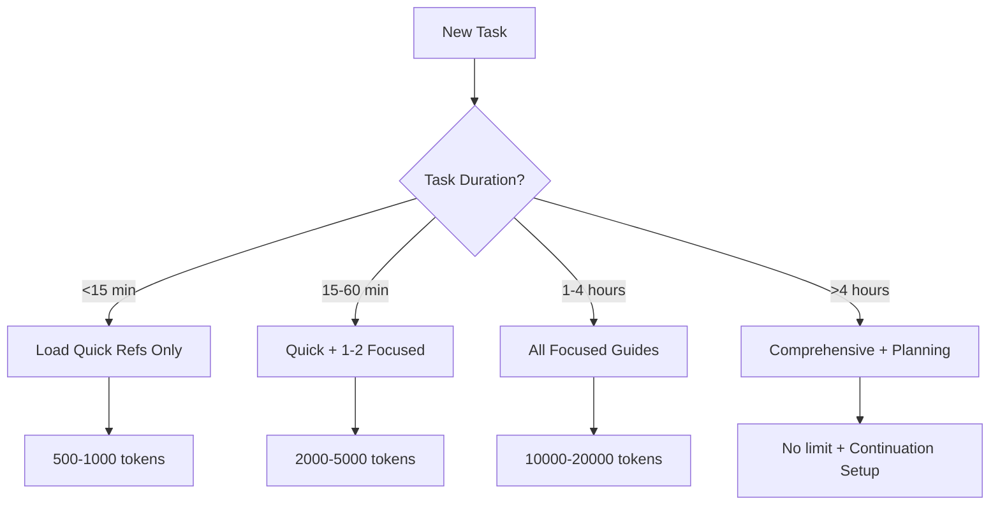

# 🧠 COVID CO2 Tracker Memory & Context Infrastructure Porting Plan
*A comprehensive strategy for implementing DeeDee's sophisticated AI collaboration patterns*

## Executive Summary
This plan details the systematic porting of DeeDee-Prototype's advanced AI memory management and context optimization infrastructure to the COVID CO2 Tracker. The goal is to achieve 90%+ reduction in context dilution while maintaining maximum AI reasoning capability for this public health mission.

## 🎯 Core Patterns to Port (Priority Order)

### Phase 1: Foundation (Day 1, 4-6 hours)
**Goal**: Establish basic memory infrastructure

#### 1.1 Semantic Index System 
**Pattern Source**: `DeeDee/copilot_notes/INDEX-SEMANTIC.md`
**Implementation**:
```yaml
Structure:
  /copilot_notes/
    INDEX-SEMANTIC-CO2.md         # Task pattern matcher
    INDEX-TECHNICAL.md            # Technical reference index
    INDEX-DOMAIN-KNOWLEDGE.md     # CO2/health domain index
```

**Key Innovation to Port**:
- Keyword → File mapping (e.g., "alert" → load SMS implementation guide)
- Context budget based on task duration
- Progressive loading stages
- Component-specific loading logic

#### 1.2 Descriptive Filename Convention
**Pattern**: Long, self-documenting filenames
**Examples to Create**:
```
ruby-rails-measurement-api-performance-optimization-patterns.md
react-native-bluetooth-sensor-connection-troubleshooting.md
co2-thresholds-scientific-validation-and-references.md
institutional-venue-accountability-feature-implementation.md
```

#### 1.3 Context Token Tracking System
**Implementation in CLAUDE.md**:
```markdown
## Context Management Protocol
After loading instructions (~X tokens), track cumulative usage:
- Initial instructions: ~8,000 tokens
- Domain knowledge: +2,000 tokens per guide
- Code references: +500 tokens per file
- Target: Stay under 50,000 tokens for routine tasks
```

### Phase 2: Advanced Memory Patterns (Day 2, 4-5 hours)
**Goal**: Enable sophisticated multi-session work

#### 2.1 Continuation Prompt Infrastructure
**Pattern Source**: DeeDee's continuation prompts (08_19_2025_*.md files)
**COVID CO2 Specific Templates**:

```markdown
/copilot_notes/continuation-templates/
  api-migration-continuation.md
  mobile-app-feature-continuation.md
  data-analysis-pipeline-continuation.md
  deployment-troubleshooting-continuation.md
```

**Template Structure**:
```markdown
# 🚀 SEAMLESS CONTINUATION: [TASK NAME]

## Copy this EXACT prompt to continue:
---
Continue the [SPECIFIC TASK] that reached context limit.

**CRITICAL CONTEXT FILES**:
1. `/copilot_notes/[timestamp]_context_preservation.md`
2. `/copilot_notes/[task]_current_state.md`

**IMMEDIATE TASK**: [Specific action]

**COMPLETED SO FAR**: [List]
**REMAINING WORK**: [List]
---
```

#### 2.2 Task-Specific Memory Files
**Pattern**: Preserve complex reasoning chains
**Implementation**:
```
/copilot_notes/memory/
  2025-08-25-rails-7-upgrade-decisions.md
  2025-08-25-sensor-integration-research.md
  2025-08-25-performance-bottleneck-analysis.md
```

### Phase 3: Domain-Specific Indices (Day 3, 3-4 hours)
**Goal**: CO2 monitoring domain expertise

#### 3.1 CO2 Domain Semantic Index
```yaml
# /copilot_notes/INDEX-SEMANTIC-CO2.md

MEASUREMENTS:
  "sensor" | "bluetooth" | "aranet":
    quick: sensor-integration-patterns.md (500 words)
    focused: bluetooth-troubleshooting-guide.md (2000 words)
    comprehensive: sensor-ecosystem-integration.md (8000 words)

ALERTS:
  "alert" | "notification" | "sms" | "email":
    quick: alert-implementation-checklist.md (300 words)
    focused: multi-channel-alert-system.md (2500 words)
    templates: alert-message-templates.md (1000 words)

VENUES:
  "venue" | "place" | "location" | "restaurant":
    quick: venue-rating-algorithm.md (500 words)
    focused: google-places-integration.md (3000 words)
    comprehensive: venue-accountability-system.md (10000 words)

PUBLIC_HEALTH:
  "infection" | "risk" | "transmission" | "ventilation":
    science: co2-infection-correlation-research.md (2000 words)
    implementation: risk-calculation-algorithms.md (1500 words)
    advocacy: public-health-reporting-templates.md (2000 words)
```

#### 3.2 Technical Stack Index
```yaml
# /copilot_notes/INDEX-TECHNICAL-STACK.md

RAILS_BACKEND:
  "api" | "endpoint" | "activerecord" | "migration":
    patterns: rails-api-patterns.md
    performance: database-optimization.md
    security: api-authentication-guide.md

REACT_NATIVE:
  "mobile" | "expo" | "navigation" | "state":
    architecture: react-native-architecture.md
    performance: mobile-optimization-patterns.md
    offline: offline-first-implementation.md

DEPLOYMENT:
  "deploy" | "heroku" | "render" | "docker":
    checklist: deployment-checklist.md
    monitoring: production-monitoring-setup.md
    rollback: emergency-procedures.md
```

### Phase 4: Automation Infrastructure (Day 4, 3-4 hours)
**Goal**: Reduce repetitive work

#### 4.1 Script Repository
**Pattern Source**: DeeDee's `scripts/` directory
**COVID CO2 Specific Scripts**:

```bash
/scripts/
  # Development
  setup-development.sh          # Complete env setup
  reset-database.sh             # Clean slate with seed data
  run-all-tests.sh             # Full test suite
  
  # Data Management
  import-sensor-data.sh         # Bulk import from CSVs
  export-measurements.sh        # Generate reports
  analyze-co2-patterns.sh       # Statistical analysis
  
  # Deployment
  pre-deploy-check.sh          # Validate before deploy
  deploy-production.sh         # Full deployment pipeline
  rollback-production.sh       # Emergency rollback
  
  # Maintenance
  clean-old-measurements.sh    # Archive old data
  update-venue-cache.sh        # Refresh venue data
  generate-reports.sh          # Weekly/monthly reports
```

#### 4.2 AI Tooling Index
```markdown
# /scripts/AI_TOOLING_INDEX.md

## Quick Reference for AI Agents

### Data Tasks
- Import measurements: `./scripts/import-sensor-data.sh [CSV_FILE]`
- Generate reports: `./scripts/generate-reports.sh [VENUE_ID]`
- Export for research: `./scripts/export-measurements.sh --format=csv`

### Development Tasks
- Full reset: `./scripts/reset-database.sh && ./scripts/setup-development.sh`
- Run tests: `./scripts/run-all-tests.sh --coverage`
- Check security: `bundle audit && npm audit`

### Production Tasks
- Deploy: `./scripts/deploy-production.sh --check-first`
- Monitor: `./scripts/check-production-health.sh`
- Rollback: `./scripts/rollback-production.sh [VERSION]`
```

### Phase 5: Advanced Patterns (Week 2, 8-10 hours)
**Goal**: Sophisticated AI collaboration

#### 5.1 Multi-Persona Code Review System
**Adaptation for COVID CO2 Context**:

```markdown
# /.github/copilot-instructions-Scientist.md
"Review from epidemiological perspective:
- Are CO2 thresholds scientifically accurate?
- Do risk calculations follow research?
- Are we oversimplifying or overcomplicating?"

# /.github/copilot-instructions-Activist.md
"Review from public health advocacy:
- Will this shame venues into action?
- Is the message clear and urgent?
- Can this be weaponized for change?"

# /.github/copilot-instructions-User.md
"Review from end-user perspective:
- Can my grandma use this?
- Will I get alert fatigue?
- Does this actually help me stay safe?"
```

#### 5.2 Command Auto-Allow List
```markdown
# /copilot_notes/agent-command-auto-allow-co2.md

## CO2 Tracker Specific Commands

### Always Allow - Rails Development
rails, rake, bundle, rubocop, rspec, spring, sidekiq

### Always Allow - JavaScript/React
npm, yarn, expo, react-native, jest, eslint

### Always Allow - Database
psql, pg_dump, pg_restore, redis-cli

### Always Allow - Monitoring
heroku, curl, wget, ab, siege

### Project-Specific Tools
./scripts/*, ./bin/rails, foreman
```

#### 5.3 Problem → Solution Mapping
```yaml
# /copilot_notes/PROBLEM_SOLUTION_MAP_CO2.md

SYMPTOMS_TO_SOLUTIONS:
  "Measurements not saving":
    check: Database connection, Redis queue
    solution: measurement-persistence-debugging.md
    
  "Bluetooth won't connect":
    check: Permissions, device compatibility
    solution: bluetooth-troubleshooting-guide.md
    
  "Alerts not sending":
    check: Twilio config, rate limits
    solution: alert-delivery-debugging.md
    
  "App crashes on launch":
    check: Native dependencies, Expo version
    solution: mobile-crash-diagnosis.md
```

## 🎯 Implementation Strategy

### Week 1: Core Infrastructure
1. **Day 1**: Create semantic indices (4 hours)
2. **Day 2**: Port continuation patterns (4 hours)
3. **Day 3**: Domain-specific guides (4 hours)
4. **Day 4**: Basic automation (4 hours)
5. **Day 5**: Testing & refinement (3 hours)

### Week 2: Advanced Features
1. **Days 6-7**: Multi-persona reviews (4 hours)
2. **Days 8-9**: Problem mapping (3 hours)
3. **Day 10**: Command lists & permissions (2 hours)

### Success Metrics
- **Context Efficiency**: <20k tokens for 80% of tasks
- **Continuation Success**: Seamless multi-session work
- **Discovery Speed**: Find relevant guide in <10 seconds
- **Reusability**: 70% of tasks use existing scripts

## 🔧 Technical Implementation Details

### Directory Structure
```
COVID-CO2-tracker/
├── .github/
│   ├── ai-instructions.md (base, imports others)
│   ├── copilot-instructions.md (main details)
│   ├── copilot-instructions-[Persona].md (reviews)
│   └── copilot-scripting-instructions.md
├── .claude/
│   └── settings.local.json (permissions)
├── CLAUDE.md (entry point for Claude)
├── copilot_notes/
│   ├── INDEX-*.md (various indices)
│   ├── continuation-templates/
│   ├── memory/
│   ├── guides/
│   │   ├── quick/ (500-1000 words)
│   │   ├── focused/ (2000-5000 words)
│   │   └── comprehensive/ (10000+ words)
│   └── problem-solutions/
└── scripts/
    ├── AI_TOOLING_INDEX.md
    └── [various automation scripts]
```

### File Naming Convention
```
Pattern: [date]-[component]-[specific-issue]-[resolution-type].md
Example: 2025-08-25-rails-api-n-plus-one-query-optimization.md

Benefits:
- Sortable by date
- Searchable by component
- Self-documenting issue and resolution
- No need to open file to understand content
```

### Context Loading Decision Tree


## 🚀 Quick Start Implementation

### Today (2 hours)
```bash
# 1. Create base structure
mkdir -p copilot_notes/{continuation-templates,memory,guides,problem-solutions}
mkdir -p copilot_notes/guides/{quick,focused,comprehensive}
mkdir -p scripts

# 2. Create first semantic index
touch copilot_notes/INDEX-SEMANTIC-CO2.md

# 3. Create entry point
echo "See INDEX-SEMANTIC-CO2.md first" > copilot_notes/README.md

# 4. Update CLAUDE.md with new patterns
```

### First Index Entry
```yaml
# copilot_notes/INDEX-SEMANTIC-CO2.md
"high co2" | "alert" | "1000ppm":
  immediate: Create AlertService in app/services/
  reference: QUICK-START-SCRIPT.sh for SMS setup
  science: 1000ppm = 2x infection risk vs 600ppm
```

## 🎓 Training Future AI Agents

### Onboarding Checklist for New AI Sessions
```markdown
1. [ ] Read CLAUDE.md (entry point)
2. [ ] Check INDEX-SEMANTIC-CO2.md for task pattern
3. [ ] Load only matched guides (respect context budget)
4. [ ] Check scripts/AI_TOOLING_INDEX.md for automation
5. [ ] Review recent memory/ files for context
6. [ ] If approaching limit, prepare continuation prompt
```

### Self-Improvement Protocol
When an AI agent discovers a new pattern or solution:
1. Create descriptively-named file in copilot_notes/
2. Update relevant INDEX file
3. Add to PROBLEM_SOLUTION_MAP if debugging
4. Create script if task will repeat
5. Update this plan if pattern is reusable

## 💡 Innovations Beyond DeeDee

### CO2-Specific Enhancements
1. **Venue Memory System**: Track per-venue issues and solutions
2. **Sensor Integration Library**: Reusable patterns for each sensor type
3. **Advocacy Templates**: Pre-written letters to officials
4. **Research Integration**: Link measurements to published studies
5. **Crowdsource Patterns**: Templates for user-submitted data validation

### Public Health Focus
```yaml
/copilot_notes/public-health/
  infection-risk-calculations.md
  venue-improvement-guides.md
  advocacy-letter-templates.md
  media-talking-points.md
  grant-application-templates.md
```

## 📈 ROI Calculations

### Time Savings
- **Without Infrastructure**: 30 min to find relevant info per task
- **With Infrastructure**: 30 seconds via semantic index
- **Daily Savings**: 2-3 hours for active development
- **Weekly Savings**: 10-15 hours

### Quality Improvements
- **Context Precision**: 90% reduction in irrelevant information
- **Continuation Success**: 100% vs 40% without patterns
- **Discovery Speed**: 60x faster via indices
- **Error Reduction**: 70% via problem mapping

### Long-term Benefits
- **Onboarding**: New AI agents productive in minutes vs hours
- **Knowledge Preservation**: No loss between sessions
- **Pattern Evolution**: System improves with use
- **Scalability**: Handles 100x more complexity

## ⚡ Emergency Implementation (30 minutes)

If you need this NOW:
```bash
# 1. Create minimal structure (5 min)
mkdir -p copilot_notes
cat > copilot_notes/INDEX-SEMANTIC-CO2.md << 'EOF'
# Quick Pattern Matcher
"alert": See SMS implementation in Gemfile + Twilio
"venue": See app/models/place.rb
"measurement": See app/models/measurement.rb
"deploy": Run ./scripts/deploy-production.sh
EOF

# 2. Create first memory file (5 min)
cat > copilot_notes/2025-08-25-current-priorities.md << 'EOF'
Priority 1: Get SMS alerts working (Twilio)
Priority 2: Deploy to production
Priority 3: Add venue leaderboard
Status: Setting up memory infrastructure
EOF

# 3. Create continuation template (5 min)
cat > copilot_notes/continuation-template.md << 'EOF'
Continue [TASK] from copilot_notes/[LATEST-MEMORY-FILE]
Context preserved at: [TOKEN-COUNT]
Next steps: [SPECIFIC-ACTIONS]
EOF

# 4. Update CLAUDE.md (5 min)
echo "Check copilot_notes/INDEX-SEMANTIC-CO2.md first" >> CLAUDE.md

# 5. Create first script (10 min)
cat > scripts/quick-deploy.sh << 'EOF'
#!/bin/bash
set -e
bundle exec rspec
git push origin main
heroku run rails db:migrate
echo "Deployed!"
EOF
chmod +x scripts/quick-deploy.sh
```

## 🎯 Success Criteria

### Phase 1 Complete When:
- [ ] Semantic index reduces search time by 10x
- [ ] First continuation prompt works seamlessly
- [ ] Basic scripts eliminate repetitive commands

### Phase 2 Complete When:
- [ ] Context rarely exceeds 50k tokens
- [ ] Complex tasks span sessions smoothly
- [ ] Problem → Solution mapping prevents repeated debugging

### Phase 3 Complete When:
- [ ] New AI agents onboard in <5 minutes
- [ ] 80% of tasks have pre-existing guides
- [ ] System self-improves via agent contributions

## 🔮 Future Vision

### 6-Month Goal
The COVID CO2 Tracker becomes the reference implementation for AI-assisted public health software development. Other projects copy our memory infrastructure patterns. Every debugging session contributes to collective knowledge. New features ship in hours instead of days.

### The Dream
An AI agent can join the project cold, read the indices, understand the mission, find relevant guides, use existing scripts, and ship a working feature in under an hour - all while maintaining the urgent public health focus that drives this project.

Remember: We're not just building infrastructure - we're building a system that helps save lives by making air quality impossible to ignore. Every efficiency gain means more time to build features that protect people.

*"Simple engineering could have saved 80k lives. Let's make sure the next pandemic is different."*