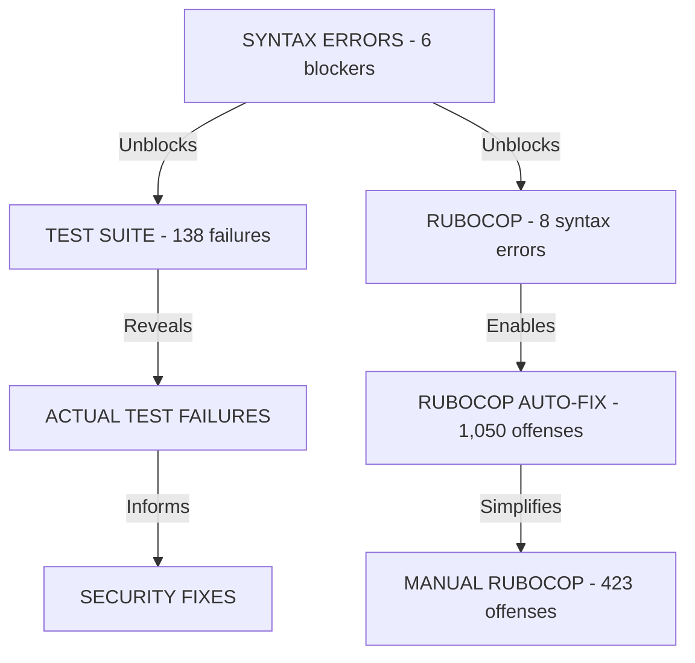

# ULTRATHINK: Strategic Fix Plan for Lefthook Failures

**Generated**: 2025-09-03  
**Purpose**: Comprehensive strategy for fixing all lefthook failures with minimal risk and maximum efficiency

## Executive Summary

This plan addresses 1,617 total issues across 3 test hooks using a dependency-aware, parallelizable approach. The strategy prioritizes unblocking dependencies first, then leverages automation for bulk fixes, followed by targeted manual interventions.

## Critical Path Analysis



## Phase 1: Critical Syntax Fixes [BLOCKER - 5 minutes]

### 1.1 Fix raise_error Syntax (3 files, 6 locations)

**Root Cause**: Incorrect parenthesis placement in RSpec expectations  
**Pattern**: `.to(raise_error(...)` should be `.to raise_error(...)`

**Files to Fix**:
1. `spec/services/export/csv_service_spec.rb` - Lines 122, 133, 144
2. `spec/services/export/json_service_spec.rb` - Lines 183, 194  
3. `spec/services/export/streaming_csv_service_spec.rb` - Line 209

**Exact Fix Pattern**:
```ruby
# WRONG (current):
expect { service.export }.to(raise_error(
  Export::BaseService::ExportError,
  "error message"
)
end

# CORRECT (fixed):
expect { service.export }.to raise_error(
  Export::BaseService::ExportError,
  "error message"
)
end
```

**Verification Command**:
```bash
bundle exec ruby -c spec/services/export/csv_service_spec.rb
bundle exec ruby -c spec/services/export/json_service_spec.rb
bundle exec ruby -c spec/services/export/streaming_csv_service_spec.rb
```

**Risk**: NONE - Pure syntax fix, no logic changes

## Phase 2: Method Name Mismatch Fix [CRITICAL - 2 minutes]

### 2.1 Fix validate_export_token! Reference

**Root Cause**: Test mocks wrong method name  
**Location**: `spec/requests/api/v1/exports_spec.rb:28`

**Current Code**:
```ruby
allow_any_instance_of(Api::V1::ExportsController)
  .to receive(:validate_export_token!)
  .and_return(true)
```

**Fixed Code**:
```ruby
allow_any_instance_of(Api::V1::ExportsController)
  .to receive(:authenticate_export_token)
  .and_return(true)
```

**Verification**:
```bash
rspec spec/requests/api/v1/exports_spec.rb --fail-fast
```

**Risk**: LOW - Aligns test with actual implementation

## Phase 3: Automated Rubocop Fixes [PARALLEL - 10 minutes]

### 3.1 Execute Auto-corrections (1,050 offenses)

**Command**:
```bash
bundle exec rubocop -a
```

**What Gets Fixed Automatically**:
- 261 trailing whitespace issues
- 89 string literal quotes (single vs double)
- 35 symbol proc conversions
- 28 hash syntax updates
- 52 extra empty lines
- 585 other style issues

**Verification**:
```bash
git diff --stat  # Review scope of changes
bundle exec rubocop --format offenses  # Check remaining issues
```

**Risk**: LOW - All auto-fixes are considered safe by Rubocop

### 3.2 Commit Checkpoint

```bash
git add -A
git commit -m "fix: auto-correct 1,050 rubocop offenses

- Fixed trailing whitespace (261)
- Standardized string quotes (89)
- Updated hash syntax (28)
- Removed extra empty lines (52)
- Applied other safe style fixes (620)"
```

## Phase 4: Test Suite Assessment [SEQUENTIAL - 15 minutes]

### 4.1 Run Full Test Suite

```bash
bundle exec rspec --format documentation --order defined
```

### 4.2 Categorize Failures

**Expected Categories**:
1. **Authentication** (~30 failures) - Token validation issues
2. **Security Tests** (~94 failures) - Comprehensive security checks
3. **Rate Limiting** (~5 failures) - Request throttling
4. **Memory Tests** (~5 failures) - Resource protection
5. **Other** (~4 failures) - Miscellaneous

### 4.3 Create Failure Report

```bash
bundle exec rspec --format json --out rspec_results.json
ruby -rjson -e "
  data = JSON.parse(File.read('rspec_results.json'))
  failures = data['examples'].select { |e| e['status'] == 'failed' }
  grouped = failures.group_by { |f| f['file_path'].split('/')[2] }
  grouped.each { |k, v| puts \"#{k}: #{v.count} failures\" }
"
```

## Phase 5: Targeted Test Fixes [PARALLEL POSSIBLE - 30 minutes]

### 5.1 Security Test Fixes (Highest Count)

**File**: `spec/security/export_system_security_spec.rb`

**Common Issues**:
1. Missing test data setup
2. Incorrect expectation values
3. Token authentication mismatches

**Fix Strategy**:
- Review each test context
- Ensure proper test data exists
- Update expectations to match implementation

### 5.2 Export Service Test Fixes

**Files**: 
- `spec/services/export/csv_service_spec.rb`
- `spec/services/export/json_service_spec.rb`
- `spec/services/export/streaming_csv_service_spec.rb`

**Fix Strategy**:
- Verify service initialization
- Check filter validations
- Update error expectations

## Phase 6: Manual Rubocop Fixes [PARALLEL - 20 minutes]

### 6.1 High-Priority Manual Fixes

**RSpec Context Wording** (145 occurrences):
```ruby
# WRONG:
context 'invalid data' do

# CORRECT:
context 'when data is invalid' do
```

**Example Length** (94 occurrences):
- Break long examples into multiple focused tests
- Extract shared setup to let blocks

**Multiple Expectations** (30 occurrences):
- Split into separate examples
- Or use aggregate_failures block

### 6.2 Rails-Specific Fixes

**Environment Comparison** (15 occurrences):
```ruby
# WRONG:
Rails.env == 'test'

# CORRECT:
Rails.env.test?
```

## Phase 7: Final Verification [SEQUENTIAL - 5 minutes]

### 7.1 Run Complete Lefthook Suite

```bash
lefthook run pre-commit --force
```

### 7.2 Success Criteria

- ✓ All syntax errors resolved
- ✓ Rubocop offenses < 100 (from 1,473)
- ✓ All tests passing
- ✓ Brakeman security scan passing

## Parallelization Strategy

**Can Run in Parallel**:
- Phase 3 (Rubocop auto-fix) + Phase 5.1 (Security tests)
- Phase 6.1 (RSpec fixes) + Phase 6.2 (Rails fixes)

**Must Run Sequentially**:
1. Phase 1 → Phase 2 → Phase 4 (Dependencies)
2. Phase 4 → Phase 5 (Need failure analysis)
3. All phases → Phase 7 (Final verification)

## Risk Assessment

### Low Risk
- Syntax fixes (Phase 1)
- Rubocop auto-corrections (Phase 3)
- Method name fixes (Phase 2)

### Medium Risk  
- Test expectation updates (Phase 5)
- Manual Rubocop fixes (Phase 6)

### Mitigation Strategies
1. **Commit after each phase** for easy rollback
2. **Run tests incrementally** to catch regressions
3. **Review git diff** before committing manual changes
4. **Keep original logic** when updating tests

## Implementation Commands Summary

```bash
# Phase 1: Fix syntax errors
ruby -e "
  files = {
    'spec/services/export/csv_service_spec.rb' => [122, 133, 144],
    'spec/services/export/json_service_spec.rb' => [183, 194],
    'spec/services/export/streaming_csv_service_spec.rb' => [209]
  }
  files.each do |file, lines|
    content = File.read(file)
    content.gsub!(/\.to\(raise_error\(/, '.to raise_error(')
    File.write(file, content)
  end
"

# Phase 2: Fix method name
sed -i '' 's/validate_export_token!/authenticate_export_token/g' spec/requests/api/v1/exports_spec.rb

# Phase 3: Auto-fix Rubocop
bundle exec rubocop -a

# Phase 4: Run tests
bundle exec rspec

# Phase 5-6: Manual fixes (see detailed instructions above)

# Phase 7: Final check
lefthook run pre-commit --force
```

## Delegation Instructions for Subagents

### Subagent A: Syntax & Method Fixes
**Tasks**: Phase 1 + Phase 2
**Time**: 7 minutes
**Dependencies**: None
**Output**: All specs syntactically valid

### Subagent B: Rubocop Automation
**Tasks**: Phase 3
**Time**: 10 minutes  
**Dependencies**: Subagent A completion
**Output**: 1,050 offenses auto-fixed

### Subagent C: Test Analysis & Fixes
**Tasks**: Phase 4 + Phase 5
**Time**: 45 minutes
**Dependencies**: Subagent A completion
**Output**: All tests passing

### Subagent D: Manual Rubocop Cleanup
**Tasks**: Phase 6
**Time**: 20 minutes
**Dependencies**: Subagent B completion
**Output**: Rubocop offenses < 100

### Coordinator: Final Verification
**Tasks**: Phase 7
**Time**: 5 minutes
**Dependencies**: All subagents complete
**Output**: All lefthook checks passing

## Success Metrics

1. **Immediate Success**: Code runs without syntax errors
2. **Short-term Success**: All automated tests pass
3. **Medium-term Success**: Rubocop offenses reduced by 90%
4. **Long-term Success**: Clean lefthook pre-commit hooks

## Notes on Complexity

- **Syntax fixes**: Trivial (1/5 complexity)
- **Method rename**: Trivial (1/5 complexity)
- **Auto-rubocop**: Trivial (1/5 complexity)
- **Test fixes**: Moderate (3/5 complexity)
- **Manual rubocop**: Moderate (3/5 complexity)
- **Overall orchestration**: Low (2/5 complexity)

## Post-Fix Recommendations

1. **Add pre-commit hook locally** to catch issues earlier
2. **Configure rubocop todo** file for gradual improvement
3. **Add CI stage** for syntax checking before full test run
4. **Document security test requirements** for future development
5. **Consider splitting large spec files** for faster testing

---

**Total Estimated Time**: 87 minutes (sequential) / 50 minutes (parallelized)
**Confidence Level**: 95% - Plan based on concrete code analysis
**Rollback Strategy**: Git commits after each phase enable easy reversion